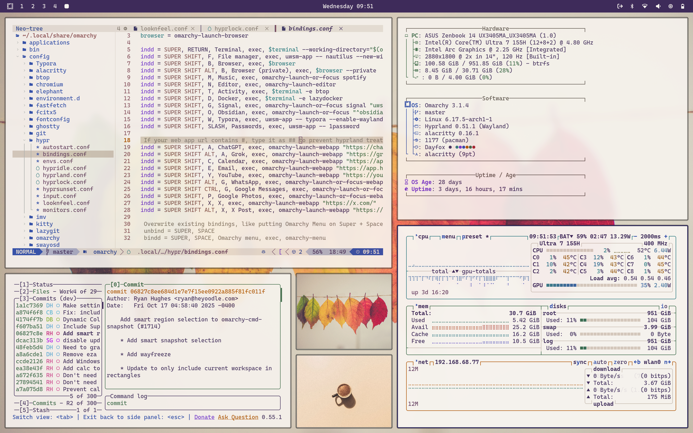

# RubyLLM Dark Theme for Omarchy

RubyLLM Dark is a warm, espresso-toned Omarchy theme built around the RubyLLM dark palette.



## Install

```bash
omarchy-theme-install https://github.com/crmne/omarchy-ruby-llm-dark-theme
```

Then activate:

```bash
omarchy-theme-set ruby-llm-dark
```

## What's Included

- Terminal palettes: `alacritty.toml`, `ghostty.conf`, `kitty.conf`
- WM/UI styling: `hyprland.conf`, `hyprlock.conf`, `waybar.css`, `walker.css`, `swayosd.css`
- Notifications/system: `mako.ini`, `btop.theme`, `icons.theme`
- Editor integration: `neovim.lua`, `vscode.json`
- Browser seed color: `chromium.theme`
- Wallpapers: `backgrounds/`

## Core Colors

- Background: `#171315`
- Foreground: `#f5ede8`
- Accent red: `#d44b36`
- Accent coral: `#ff9b88`

## Notes

- This theme includes temporary wallpaper picks that will be replaced in a later pass.
- VS Code integration uses Catppuccin Mocha (`catppuccin.catppuccin-vsc`).

## License

[MIT](LICENSE)
