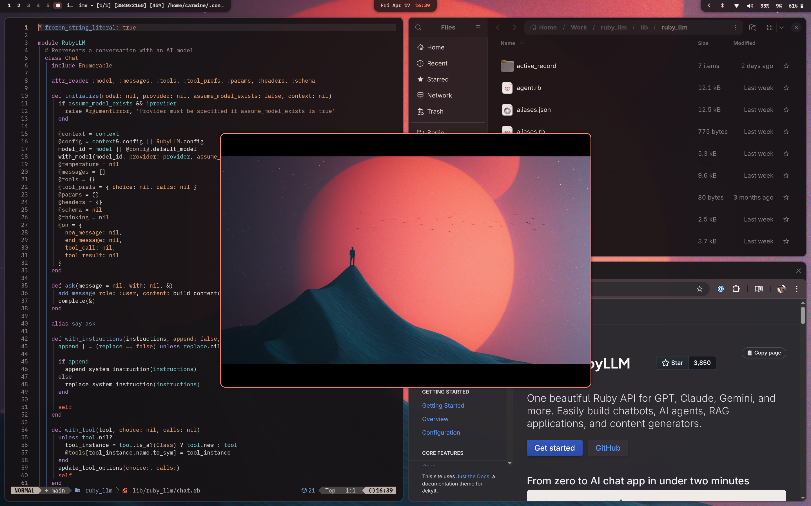

# RubyLLM Dark for Omarchy Quattro

A warm, espresso-toned dark theme derived from the RubyLLM visual identity.



## Install

```bash
omarchy theme install https://github.com/crmne/omarchy-ruby-llm-dark-theme.git
```

Activate it with:

```bash
omarchy theme set ruby-llm-dark
```

## Architecture

This is a declarative Omarchy Quattro theme. It provides only:

- A semantic palette in `colors.toml`
- A GNOME icon theme choice in `icons.theme`
- Wallpapers in `backgrounds/`
- A selector preview in `preview.png`

Omarchy generates and applies the terminal, shell, Hyprland, editor, browser,
Obsidian, keyboard, and btop integrations from the semantic palette. The theme
contains no executable hooks, package installation, or application-specific
configuration files.

## Core colors

- Background: `#171315`
- Surface: `#2a2428`
- Selection: `#3a2f35`
- Foreground: `#f5ede8`
- Ruby red: `#b30000`
- Bright ruby: `#c9271e`
- Green: `#759d82`
- Blue: `#7aa2c8`
- Cyan: `#6aa6a6`

## Requirements

Omarchy 4 (Quattro) or newer.

## License

[MIT](LICENSE)
